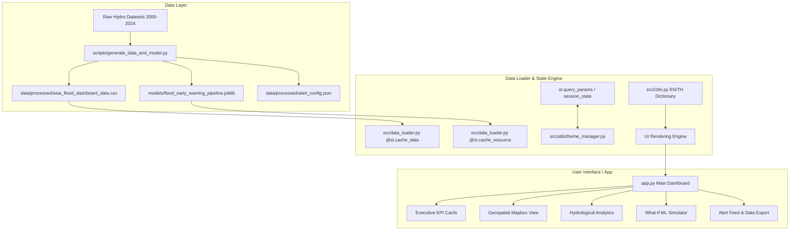

# 🌊 Asia 25-Year Flood Risk Atlas & Early Warning System (2000–2024)

[](https://www.python.org/)
[](https://streamlit.io/)
[](https://plotly.com/)
[](https://opensource.org/licenses/MIT)

An open-source, production-grade Web Application & Machine Learning Early Warning System designed for long-term hydro-meteorological risk analysis and real-time flood probability forecasting across major Asian river basins (Mekong, Chao Phraya, Ganges-Brahmaputra, Yangtze, Indus, Irrawaddy, and Red River).

---

## 📌 Architecture Diagram



---

## ✨ Key Features

- **🌐 State Persistence & Localization (EN/TH):** Seamless English and Thai bilingual support with synchronized URL query parameter state persistence (`?theme=dark&lang=th`).
- **🎨 Modern Dark & Light Mode:** Responsive UI styled with dynamic glassmorphism cards and custom CSS badges.
- **📊 Executive KPI Metrics & Baselines:** Real-time active station tracking, critical alert counts, and 25-year basin baseline delta comparisons.
- **🗺️ Interactive Mapbox Early Warning Map:** Color-coded severity bubble map with rich popups detailing rainfall, river levels, soil moisture, and risk scores.
- **📈 Multi-Variable Analytics:** Dual-axis hydro graphs (Rainfall vs. River Level), basin-wise boxplots with explicit warning lines, correlation heatmaps, and seasonal lag charts.
- **⚡ Real-Time "What-If" Inference Simulator:** Parameter sliders enabling real-time ML scoring using `flood_early_warning_pipeline.joblib` and Plotly gauge display.
- **📥 Open Data Export:** One-click CSV and summary JSON statistical exports.

---

## 🗂️ Project Repository Structure

```
asia-flood-early-warning-dashboard/
├── .github/
│   └── workflows/
│       └── deploy.yml                # CI/CD automated test & deployment workflow
├── data/
│   ├── raw/                          # Raw dataset storage location
│   └── processed/
│       ├── asia_flood_dashboard_data.csv   # Synthesized 25-year hydro-meteorological dataset (2000-2024)
│       └── alert_config.json               # Calibrated alert levels & optimal decision thresholds
├── models/
│   └── flood_early_warning_pipeline.joblib # Scikit-learn Pipeline (ColumnTransformer + Model)
├── scripts/
│   └── generate_data_and_model.py    # Automation script to train ML pipeline and generate data
├── src/
│   ├── __init__.py
│   ├── config.py                     # Global paths, alert color maps, baselines
│   ├── i18n.py                       # Bilingual translation dictionary (EN & TH)
│   ├── data_loader.py                # Data loading, filtering, & KPI calculators
│   ├── components/
│   │   ├── __init__.py
│   │   ├── kpi_cards.py              # Metric summary cards renderer
│   │   ├── map_view.py               # Mapbox geospatial map with custom popups
│   │   ├── time_series_charts.py     # Dual-axis, boxplot, heatmap, lag charts
│   │   ├── simulator.py              # Interactive what-if ML inference module
│   │   └── alert_feed.py             # Live warning ticker & station status table
│   └── utils/
│       ├── __init__.py
│       └── theme_manager.py          # Dynamic CSS injection & query param persistence
├── static/
│   └── css/
│       └── custom.css                # Premium modern dashboard CSS
├── app.py                            # Main Streamlit web application entry point
├── requirements.txt                  # Locked dependencies
├── .gitignore                        # Python artifacts ignore list
└── README.md                         # Project documentation
```

---

## 🚀 Quickstart Guide

### 1. Clone & Setup Environment
```bash
git clone https://github.com/your-username/asia-flood-early-warning-dashboard.git
cd asia-flood-early-warning-dashboard
python -m venv venv
source venv/bin/activate  # On Windows: venv\Scripts\activate
pip install -r requirements.txt
```

### 2. Generate Dataset & Train Model Pipeline
```bash
python scripts/generate_data_and_model.py
```

### 3. Launch Web Application
```bash
streamlit run app.py
```

Open your browser at `http://localhost:8501`. Try passing `http://localhost:8501/?lang=th&theme=dark` to experience instant state persistence!

---

## 📊 Model Thresholds & Risk Classification

The system utilizes a calibrated **Logistic Regression Pipeline** trained on standardized hydrological and meteorological telemetry:

| Severity Level | Risk Probability Range | Color Code | Action Required |
| :--- | :--- | :--- | :--- |
| **Normal (Green)** | `0.00 – 0.46` | `#10B981` | Baseline telemetry tracking |
| **Warning (Yellow)** | `0.46 – 0.70` | `#F59E0B` | Caution; inspect spillways & gauge frequency |
| **Severe (Orange)** | `0.70 – 0.92` | `#F97316` | Issue pre-evacuation notices |
| **Critical (Red)** | `0.92 – 1.00` | `#EF4444` | Emergency response mobilization |

---

## 📜 License
Released under the **MIT License**. Built for open-source disaster resilience across Asia.
